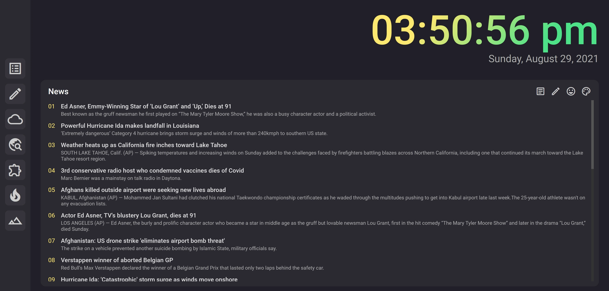

# aTab

This is an extension that will replace your new tab into a more productive and useful interface! The interface features an aesthetic dark material theme, a news feed (from the [News API](https://newsapi.org/)), a list of customizable links on a sidebar, a place to jot down quick notes that can sync across devices, and a nice date/time display.

# Screenshots

## Install the Extension

Check in the [releases tab](https://github.com/MichaelZhao21/task-tab/releases) and download `task-tab-X.X.xpi` (where X.X is the version) and follow [these instructions](https://extensionworkshop.com/documentation/publish/distribute-sideloading/) to add the plugin to firefox! The goal is to eventually get this on the mozilla addons store :))

## Development

The app requires **Nodejs v.16+**. To install the app, run `yarn install`. This should install all dependencies and allow you to run the dev or build scripts.

`yarn start` runs webpack with a file watcher, which means that all changes will trigger a rebuild. Follow [this guide](https://extensionworkshop.com/documentation/develop/temporary-installation-in-firefox/) to install a temporary add-on (select the `manifest.json` file). When webpack rebuilds the app, simply refresh your new tab page and the changes that you have made should show up.

There are certain limitations that you must be aware of when working with an extension! You cannot use any templating engine, which rules out a lot of libraries. There are workarounds, but for my simple app it was more of a hassle than it was worth. That means a lot of the UI modifications I do are using jquery (I know, pretty archaic haha), but I still try to stick to modern coding paradigms and file splitting.

# Build

To build the extension, run `yarn build`. This command should run the production build of webpack and zip the output files into `atab.zip`, which is the version that is uploaded to the mozilla extensions workshop.

# Icons

All icons used in this app are from [Google Material Icons](https://fonts.google.com/icons). The list of icon names that is stored in `src/icons.json` are from [github/google: material-design-icons/font/MaterialIconsOutlined-Regular.codepoints](https://github.com/google/material-design-icons/blob/master/font/MaterialIconsOutlined-Regular.codepoints).
